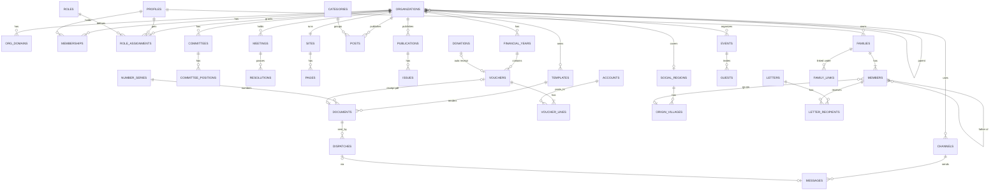

# ER Diagram — मुख्य संबंध

GitHub पर यह diagram अपने आप चित्र में दिखेगा।

```mermaid
erDiagram
  ORGANIZATIONS ||--o{ ORGANIZATIONS : "parent"
  ORGANIZATIONS ||--o{ ORG_DOMAINS : has
  ORGANIZATIONS ||--o{ MEMBERSHIPS : has
  PROFILES ||--o{ MEMBERSHIPS : holds
  ORGANIZATIONS ||--o{ ROLE_ASSIGNMENTS : grants
  PROFILES ||--o{ ROLE_ASSIGNMENTS : gets
  ROLES ||--o{ ROLE_ASSIGNMENTS : defines
  ORGANIZATIONS }o--o| SOCIAL_REGIONS : "covers"

  ORGANIZATIONS ||--o{ COMMITTEES : has
  COMMITTEES ||--o{ COMMITTEE_POSITIONS : has
  ORGANIZATIONS ||--o{ MEETINGS : holds
  MEETINGS ||--o{ RESOLUTIONS : passes

  ORGANIZATIONS ||--|| SITES : runs
  SITES ||--o{ PAGES : has
  ORGANIZATIONS ||--o{ POSTS : publishes
  CATEGORIES ||--o{ POSTS : groups
  ORGANIZATIONS ||--o{ PUBLICATIONS : publishes
  PUBLICATIONS ||--o{ ISSUES : has

  ORGANIZATIONS ||--o{ TEMPLATES : owns
  TEMPLATES ||--o{ DOCUMENTS : renders
  DOCUMENTS ||--o{ DISPATCHES : sent_by
  NUMBER_SERIES ||--o{ DOCUMENTS : numbers

  ORGANIZATIONS ||--o{ FINANCIAL_YEARS : has
  FINANCIAL_YEARS ||--o{ VOUCHERS : contains
  VOUCHERS ||--|{ VOUCHER_LINES : has
  ACCOUNTS ||--o{ VOUCHER_LINES : posts_to
  VOUCHERS |o--o| DOCUMENTS : "receipt pdf"
  DONATIONS |o--o| VOUCHERS : "auto receipt"

  ORGANIZATIONS ||--o{ EVENTS : organizes
  EVENTS ||--o{ GUESTS : invites

  ORGANIZATIONS ||--o{ CHANNELS : uses
  CHANNELS ||--o{ MESSAGES : sends
  DISPATCHES |o--o| MESSAGES : via

  SOCIAL_REGIONS ||--o{ ORIGIN_VILLAGES : has
  FAMILIES ||--|{ MEMBERS : has
  MEMBERS ||--o{ MEMBERS : "father of"
  MEMBERS }o--o| ORIGIN_VILLAGES : "मूल ग्राम"
  FAMILIES ||--o{ FAMILY_LINKS : "linked under"
  LETTERS ||--o{ LETTER_RECIPIENTS : has
  MEMBERS ||--o{ LETTER_RECIPIENTS : receives
  PROFILES ||--o{ FAMILIES : owns
```
